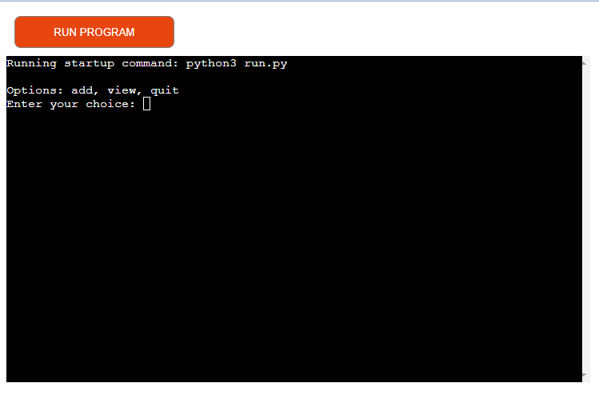
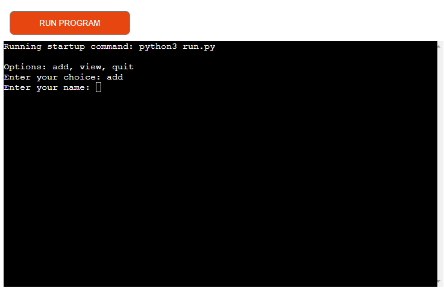
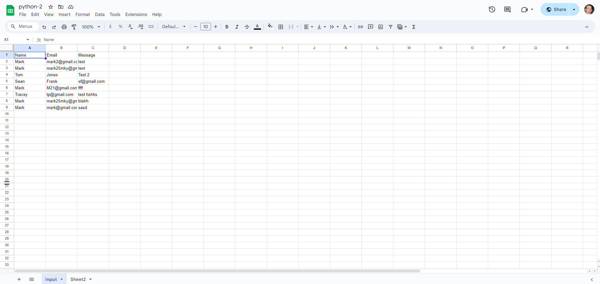
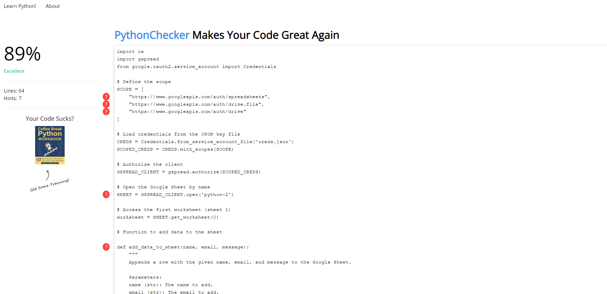

# Command-Line Data Manager


## Project Description

The Google Sheets Command-Line Data Manager is a simple yet powerful application designed to help users manage data in a Google Sheet through a command-line interface (CLI). This project leverages Python and the `gspread` library to interact with Google Sheets, making it easy to add and view data without needing to open a web browser.



### Key Features:
- **Add Data**: Users can input their name, email, and a message, which will then be appended as a new row in the Google Sheet.
- **View Data**: Users can view all existing entries in the Google Sheet, displayed directly in the terminal.

This project is particularly useful for small teams or individuals who need to collect and review data in a structured format but prefer the simplicity and speed of a command-line tool. It can be deployed locally or on cloud platforms like Heroku, making it accessible from anywhere with internet access.

### Use Cases:
- **Event Registrations**: Collect names, emails, and messages from participants.
- **Feedback Collection**: Gather feedback from users or customers in a centralized sheet.
- **Data Logging**: Maintain a log of entries for various purposes such as meeting notes, daily logs, or inventory records.


## Features

- **Add Data**: Users can add new entries with their name, email, and a message.
- **View Data**: Users can view all existing entries in the Google Sheet.

<div style="display: flex;">
    
    
</div>
## Requirements

- Python 3.x
- `gspread` library
- `google-auth` library

## Setup

1. **Clone the Repository**

   ```bash
   git clone https://github.com/Markmcl25/google-sheets-cli-manager.git
   cd google-sheets-cli-manager

2. **Install Dependencies**

    ```bash  
    pip install gspread google-auth

3.  **Set Up Google API Credentials**   

- Create a project in the Google Cloud Console.
- Enable the Google Sheets API and Google Drive API.
- Create service account credentials and download the JSON key file.
- Save the JSON key file as creds.json in the project directory.

4.  **Configure Google Sheet**

- Share your Google Sheet with the service account email found in your creds.json file.
- Update the SHEET_NAME in the code to match your Google Sheet's name.

## Usage

Run the application using Python:
- python run.py

- Add Data: Follow the prompts to enter your name, email, and message.
- View Data: Choose the 'view' option to display all entries.
- Quit: Exit the application.

## Example

````
Options: add, view, quit
Enter your choice: add
Enter your name: John Doe
Enter your email: john.doe@example.com
Enter your message: Hello, this is a test message.
Data added successfully.

Options: add, view, quit
Enter your choice: view
{'name': 'John Doe', 'email': 'john.doe@example.com', 'message': 'Hello, this is a test message.'}
````

## Bug Fixes

- **Fixed Authentication Errors:** Ensured the correct scope and service account permissions to prevent authentication errors.
- **Handled Empty Inputs:** Added validation to check for empty inputs when adding data to prevent incomplete rows.
- **Improved Error Messages:** Enhanced error handling to provide more informative error messages when operations fail.
- **Data Display Formatting:** Improved the format of data displayed in the terminal for better readability.
- **Connection Handling:** Implemented better handling for network issues to retry operations or fail gracefully with a clear message.


## Testing

No major issues on https://www.pythonchecker.com/




## Deployment

This project was deployed using the code institutes mock terminal for Heroku.

**Steps for deployment:**

- Fork or clone repository
- Create new Heroku app
- Set the buildbacks to Python and NodeJS in that order
- Link the Heroku app to the repository
- Click on Deploy

Deployed link - https://python-2-2d45319455bf.herokuapp.com/
Google sheet link - https://docs.google.com/spreadsheets/d/1atkkaaP6NbK2gPLHcnCnkdEFDLtPW9zbTBbhv19tBc8/edit?usp=sharing

## Credits

- Code Institute for the deployment terminal


